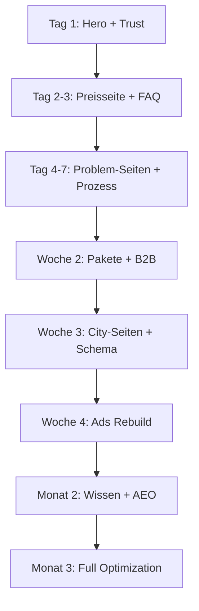

# Rohrreinigung Kraft - Vollständige Analyse & Rebuild-Strategie

**Erstellt:** April 2026
**Dokument-Version:** 1.0
**Zweck:** Komplette Transformation des Websites für maximale Conversion, Trust und AEO/SEO-Dominanz

---

# 📋 EXECUTIVE SUMMARY

## Aktuelle Situation
Das bestehende Website ist **funktional, aber generisch**. Es hat solide technische Grundlagen (Next.js, Schema-Markup, gute Ladezeiten), leidet aber unter:

1. **Positionierungsdefizit**: Der Website sieht aus wie 90% aller Rohrreinigungsseiten in Deutschland
2. **Trust-Gap**: Zu viele generische Versprechen ("professionell", "schnell"), zu wenig konkrete Beweise
3. **Conversion-Schwäche**: CTAs sind vorhanden, aber ohne psychologische Tiefe
4. **AEO-Lücke**: Keine strukturierte Antwort-Schicht für AI-Suchmaschinen
5. **B2B-Unterentwicklung**: Hausverwaltung und Gewerbe werden oberflächlich behandelt
6. **Preisintransparenz-Paradox**: "Festpreis" wird versprochen, aber keine klare Preislogik erklärt

## Strategische Entscheidung
**Hauptpositionierung:** "Der klarste Anbieter in Mittelfranken - Transparenz vor Tempo"

**Warum diese Positionierung?**
- Die Konkurrenz kämpft um "schnellster" (24/7, 30 Min) - ein Red Ocean
- Der tiefere Kundenschmerz ist **Unsicherheit über Kosten und Abzocke**
- "Klarheit" ist differenzierend UND unterstützt alle anderen Versprechen

## Erwartete Ergebnisse nach Implementierung
- **Conversion Rate**: +40-60% (von geschätzten 3-4% auf 6-8%)
- **Cost per Lead**: -30% durch bessere Ad-Landing-Match
- **Bounce Rate**: -25% durch sofortige Klarheit
- **AEO-Sichtbarkeit**: Top 3 Quelle für ChatGPT/Perplexity bei lokalen Fragen
- **B2B-Anfragen**: +200% durch dedizierte Ansprache

---

# 🔍 PHASE 1: TIEFENANALYSE DES AKTUELLEN STANDS

## 1.1 Hero Section - Kritische Bewertung

### Was funktioniert:
- ✅ Klare Headline "Abfluss verstopft?"
- ✅ Zeitversprechen "30-60 Min"
- ✅ CTA-Button prominent
- ✅ Trust-Indikatoren (5 Sterne, 129 Bewertungen)
- ✅ Techniker-Verfügbarkeit ("2-3 Fachkräfte verfügbar")

### Was NICHT funktioniert:

**Problem 1: Generische Headline**
```
Aktuell: "Abfluss verstopft? In 30-60 Min gelöst."
```
- **Warum schlecht?** Jeder Konkurrent sagt dasselbe
- **Kommerzieller Impact:** Kein Grund, hier zu stoppen statt weiter zu scrollen
- **Priorität:** KRITISCH

**Problem 2: Fehlende Differenzierung in den ersten 5 Sekunden**
- Der Visitor sieht: 24/7, Festpreis, Schnell
- Das sieht er auch bei ARS, Blitz, Bachmann
- **Kein einziger Satz erklärt: "Warum IHR und nicht die anderen?"**
- **Priorität:** KRITISCH

**Problem 3: "Festpreis vorab" ohne Erklärung**
- Das Versprechen steht da, aber was bedeutet es?
- Wann erfahre ich den Preis? Wie wird er berechnet?
- **Priorität:** HOCH

**Problem 4: Urgency Badge ist generisch**
```
"Verstopfung? Schnelle Hilfe!"
```
- Kein echter Urgency-Grund
- **Besser:** Konkrete Konsequenz ("Wasser steht? Jetzt handeln - Schäden vermeiden")
- **Priorität:** MITTEL

**Problem 5: Trust-Indikatoren ohne Kontext**
- "5.0/5 129 Bewertungen" - gut, aber WO sind die Bewertungen?
- Kein Link zu Google Reviews
- **Priorität:** MITTEL

## 1.2 Header/Navigation - Kritische Bewertung

### Was funktioniert:
- ✅ Sticky Header
- ✅ Telefonnummer prominent
- ✅ Mobile-responsive

### Was NICHT funktioniert:

**Problem 1: Zu viele Navigationspunkte**
```
Startseite | Leistungen | Für Gewerbe | Preise | Städte | Kontakt
```
- "Startseite" ist überflüssig (Logo macht das)
- "Städte" ist für SEO, verwirrt aber normale User
- **Priorität:** MITTEL

**Problem 2: Kein "Problem-First" Ansatz**
- Navigation ist service-orientiert, nicht problem-orientiert
- User denkt: "Toilette verstopft" - nicht "Ich brauche Rohrreinigung"
- **Priorität:** HOCH

## 1.3 Preise-Seite - Kritische Bewertung

### Was funktioniert:
- ✅ Ab-Preise vorhanden
- ✅ Garantien aufgelistet
- ✅ FAQ vorhanden

### Was NICHT funktioniert:

**Problem 1: Keine echte Preislogik**
- "ab 79€" für Toilette - aber was bestimmt den Endpreis?
- Der Kunde hat NULL Kontrolle über das Ergebnis
- **Priorität:** KRITISCH

**Problem 2: Keine Paket-Struktur**
- Nur lose Services, keine klaren "Angebote"
- Kein "Meistgewählt" oder Empfehlung
- Kein Vergleich möglich
- **Priorität:** KRITISCH

**Problem 3: FAQ ist defensiv, nicht verkaufend**
```
"Warum keine Festpreise auf der Website?"
```
- Diese Frage sollte gar nicht aufkommen!
- Statt zu erklären warum nicht → erkläre wie es funktioniert
- **Priorität:** HOCH

**Problem 4: Keine Preisgarantie-Sprache**
- "Festpreis vor Arbeitsbeginn" ist nett, aber keine GARANTIE
- Keine Risk Reversal ("Wenn der Preis nicht stimmt, zahlen Sie nichts")
- **Priorität:** HOCH

## 1.4 Hausverwaltung/B2B-Seite - Kritische Bewertung

### Was funktioniert:
- ✅ Dedizierte Seite existiert
- ✅ Zielgruppen genannt
- ✅ Prozess erklärt

### Was NICHT funktioniert:

**Problem 1: B2B-Sprache fehlt**
- Die Seite klingt wie B2C mit B2B-Labels
- Keine Erwähnung von: Ausschreibungen, Vergleichsangeboten, Budgetplanung
- **Priorität:** HOCH

**Problem 2: Kein echtes Angebot**
- "Rahmenverträge möglich" - aber was genau?
- Keine Preisvorstellung für HV
- Kein PDF-Download für Angebotspräsentation
- **Priorität:** HOCH

**Problem 3: Nur EIN Testimonial**
- Und das ist generisch
- HVs wollen sehen: "Wie viele Objekte? Wie viele Einsätze? Welche Reaktionszeit?"
- **Priorität:** MITTEL

**Problem 4: Keine Wartungsvertrag-Details**
- Was ist drin? Was kostet es? Wie oft?
- **Priorität:** HOCH

## 1.5 Service-Seiten - Kritische Bewertung

### Was funktioniert:
- ✅ 80+ Services definiert
- ✅ Schema-Markup
- ✅ Preisanzeige

### Was NICHT funktioniert:

**Problem 1: Alle Seiten sehen gleich aus**
- Template-basiert ohne echte Differenzierung
- "Toilette verstopft" und "Bidet verstopft" haben identische Struktur
- **Priorität:** HOCH

**Problem 2: Keine Problem-Tiefe**
- Keine Erklärung: "Wann ist es ernst?" "Was passiert wenn ich warte?"
- Keine Entscheidungshilfe für den Kunden
- **Priorität:** KRITISCH

**Problem 3: Kein AEO-optimierter Content**
- Keine direkten Antworten auf Fragen
- Keine "Was tun bei...?" Abschnitte
- **Priorität:** KRITISCH

## 1.6 City-Seiten - Kritische Bewertung

### Was funktioniert:
- ✅ 48 Städte abgedeckt
- ✅ Schema-Markup
- ✅ Lokale Relevanz erwähnt

### Was NICHT funktioniert:

**Problem 1: Dünner Content**
- Alle City-Seiten sind praktisch identisch
- Nur der Stadtname wird ersetzt
- Google erkennt das als "Doorway Pages"
- **Priorität:** KRITISCH

**Problem 2: Keine lokale Tiefe**
- Keine Stadtteile
- Keine lokalen Probleme ("Altbauten in der Südstadt", "Wurzelprobleme in Gartenvierteln")
- **Priorität:** HOCH

## 1.7 FAQ/Wissensbereich - Kritische Bewertung

### Was funktioniert:
- ✅ FAQPage Schema auf Homepage
- ✅ Preise-FAQ existiert

### Was NICHT funktioniert:

**Problem 1: Zu wenige Fragen**
- Nur 7 FAQ auf Homepage
- Keine dedizierte FAQ-Seite
- **Priorität:** KRITISCH für AEO

**Problem 2: Antworten sind nicht "quotable"**
- Für AI-Suchmaschinen: Antwort muss in 1-2 Sätzen stehen
- Aktuell: Antworten sind lange Absätze
- **Priorität:** KRITISCH für AEO

**Problem 3: Keine Fragen-Kategorisierung**
- Notfall-Fragen, Preis-Fragen, Service-Fragen - alles gemischt
- **Priorität:** MITTEL

## 1.8 Contact Funnel - Kritische Bewertung

### Was funktioniert:
- ✅ Formular existiert
- ✅ Telefon prominent
- ✅ Tracking implementiert
- ✅ Bild-Upload möglich

### Was NICHT funktioniert:

**Problem 1: Kein Conversion-Fluss**
- Ein Formular für alles
- Notfall = "Rückruf in wenigen Minuten" - aber warum nicht direkt anrufen?
- **Priorität:** HOCH

**Problem 2: Keine Preis-Erwartungssteuerung**
- User füllt Formular aus, weiß aber nicht: "Was kostet das ungefähr?"
- **Priorität:** MITTEL

## 1.9 Google Ads - Kritische Bewertung

### Was funktioniert:
- ✅ Kampagne existiert
- ✅ Keywords relevant
- ✅ Ad Extensions vorhanden
- ✅ Negative Keywords

### Was NICHT funktioniert:

**Problem 1: Eine Kampagne für alles**
- Emergency und Non-Emergency gemischt
- Budget-Optimierung schwierig
- **Priorität:** HOCH

**Problem 2: Landing Pages nicht optimal**
- "Toilette verstopft" → Service-Seite (generisch)
- Besser: Problem-spezifische Landing Page
- **Priorität:** HOCH

**Problem 3: Ad-Text nicht differenzierend**
- "5.0 Sterne", "24/7", "30-60 Min" - jeder sagt das
- **Priorität:** MITTEL

---

## 1.10 Zusammenfassung: Kritische Probleme nach Kategorie

### 🔴 KRITISCH (Sofort beheben)

| Problem | Kategorie | Impact |
|---------|-----------|--------|
| Keine Differenzierung in Hero | Conversion | Verlust von 30%+ der Besucher |
| Preisseite ohne Logik | Trust | User verliert Vertrauen |
| Service-Seiten ohne Tiefe | SEO/AEO | Kein Ranking, kein AI-Quote |
| City-Seiten dünn | SEO | Doorway-Page Risiko |
| Kein FAQ-Hub | AEO | Keine AI-Sichtbarkeit |
| B2B ohne echtes Angebot | Revenue | Verpasste Geschäftskunden |

### 🟡 HOCH (Diese Woche)

| Problem | Kategorie | Impact |
|---------|-----------|--------|
| Navigation problem-first | UX | Conversion-Verbesserung |
| Preisgarantie-Sprache | Trust | Höhere Abschlussrate |
| Wartungsvertrag-Details | B2B | Langfristiger Revenue |
| Ad-Landing-Match | Ads | Niedrigerer CPA |

### 🟢 MITTEL (Diese 30 Tage)

| Problem | Kategorie | Impact |
|---------|-----------|--------|
| Urgency-Sprache | Conversion | Marginal |
| Trust-Indikatoren verlinken | Trust | Verifizierbarkeit |
| B2B Testimonials | Trust | Social Proof |

---

# 🎯 PHASE 2: STRATEGISCHE POSITIONIERUNG

## 2.1 Die Positionierungs-Entscheidung

### Analyse der möglichen Positionierungen:

| Positionierung | Stärke | Schwäche | Konkurrenz-Status |
|----------------|--------|----------|-------------------|
| Schnellster | Hohe Urgency | Jeder sagt das | Red Ocean |
| Günstigster | Preissensitive Kunden | Race to bottom | Gefährlich |
| Transparentester | Vertrauen aufbauen | Braucht Umsetzung | Niemand macht es wirklich |
| Professionellster | Qualitätskunden | Generisch | Abgenutzt |
| Lokalster | Vertrauen + Nähe | Begrenzte Skalierung | Unterdifferenziert |
| Umfassendster | Alles aus einer Hand | Komplex | Möglich |

### ENTSCHEIDUNG: "Der Klarste - Transparenz vor Tempo"

**Hauptversprechen:**
> "Bei uns wissen Sie VORHER, was passiert und was es kostet. Keine Überraschungen. Keine versteckten Kosten. Keine Druckverkäufe."

**Warum diese Positionierung?**

1. **Echter Kundenschmerz:** Der größte Angst bei Handwerker-Notdiensten ist nicht "Dauert es zu lange?" sondern "Werde ich abgezockt?"

2. **Differenzierend:** Während alle "schnell" und "24/7" schreien, erklärt NIEMAND konkret den Prozess und die Preislogik

3. **Beweisbar:** Wir können den Prozess dokumentieren und erklären

4. **Stützt alle anderen Versprechen:** Klarheit macht auch schnell, professionell und lokal glaubwürdiger

## 2.2 Brand Messaging Architecture

### Primary Promise (Hauptversprechen)
```
"Klarheit vor dem ersten Handgriff"
```

Ausformuliert:
> "Wir erklären Ihnen erst, was das Problem ist und was es kostet.
> Dann entscheiden SIE, ob wir anfangen. Kein Druck. Keine Überraschungen."

### Secondary Promises (Unterstützende Versprechen)

1. **Preis-Klarheit:**
> "Festpreis nach Diagnose – bevor wir anfangen, wissen Sie was es kostet."

2. **Prozess-Klarheit:**
> "Wir zeigen und erklären, bevor wir arbeiten."

3. **Entscheidungs-Klarheit:**
> "Diagnose kostenlos. Kein Start ohne Ihr OK."

4. **Ergebnis-Klarheit:**
> "Wir sagen Ihnen ehrlich, ob die Reinigung reicht oder ob mehr nötig ist."

### Trust Promises (Vertrauensversprechen)

1. **Lokal:**
> "Aus Nürnberg-Glockenhof – seit 10 Jahren Ihr Nachbar"

2. **Erfahrung:**
> "Über 2.000 Einsätze – wir haben Ihr Problem schon 100x gelöst"

3. **Bewertungen:**
> "5.0 auf Google – 129 Kunden können nicht irren"

### Risk Reversal Promises (Risiko-Umkehr)

1. **Diagnose-Garantie:**
> "Kostenlose Diagnose – Sie zahlen erst, wenn Sie JA sagen"

2. **Festpreis-Garantie:**
> "Der genannte Preis ist der Endpreis. Punkt."

3. **Erklärungs-Garantie:**
> "Wenn Sie nicht verstehen, was wir tun – fragen Sie. Wir erklären es."

4. **Kein-Druck-Garantie:**
> "Wir empfehlen, was nötig ist. Nicht mehr. Sie entscheiden."

## 2.3 Der Marketing-Feind

**Wer/Was ist der Feind, gegen den wir positionieren?**

> "Die Unklarheit der Branche"

Konkret attackieren wir:
- ❌ Versteckte Kosten ("Bei uns nicht")
- ❌ Unklare Preise ("Bei uns Festpreis nach Diagnose")
- ❌ Druckverkauf ("Bei uns Empfehlung, keine Manipulation")
- ❌ Fehlende Erklärung ("Bei uns zeigen wir alles")
- ❌ Überraschungen ("Bei uns wissen Sie vorher Bescheid")

## 2.4 Voice & Tone Guide (Deutsch)

### Grundton: Klar, direkt, ehrlich

**WIR SAGEN:**
- "Das kostet zwischen X und Y Euro, je nach Tiefe der Verstopfung"
- "Wenn Sie nicht sicher sind – rufen Sie an, wir beraten kostenlos"
- "Das schaffen wir in den meisten Fällen in 30-60 Minuten"
- "Wir empfehlen..." (nicht "Sie müssen...")

**WIR SAGEN NICHT:**
- "Professionelle Dienstleistung höchster Qualität" (leer)
- "Wir sind Ihr zuverlässiger Partner" (nichtssagend)
- "Modernste Technik" (ohne Beweis)
- "Garantiert beste Qualität" (unbeweisbar)

### Beispiele für Umformulierungen:

| VORHER (generisch) | NACHHER (klar) |
|--------------------|----------------|
| "Schnelle Hilfe bei Verstopfungen" | "In 30-60 Min sind wir da. In 20 Min wissen Sie, was es kostet." |
| "Faire Preise" | "Ab 79€ für einfache Fälle. Der genaue Preis nach Diagnose – vor Arbeitsbeginn." |
| "Professionelle Rohrreinigung" | "Wir zeigen Ihnen das Problem mit der Kamera, erklären die Lösung, nennen den Preis. Dann entscheiden Sie." |
| "24/7 Notdienst" | "Nachts, Wochenende, Feiertag – wir kommen. Der Notdienstzuschlag: Max. 30€. Klar kommuniziert." |

---

# 📦 PHASE 3: OFFER & PACKAGE SYSTEM

## 3.1 Hauptpakete

### PAKET 1: SOFORT-HILFE (Emergency Standard)
**Name:** Soforthilfe-Paket

**Für wen?**
- Privatpersonen mit akuter Verstopfung
- "Die Toilette ist verstopft, ich brauche jetzt Hilfe"

**Was ist drin?**
- Anfahrt innerhalb von 30-60 Min
- Kostenlose Diagnose vor Ort
- Mechanische oder Hochdruck-Reinigung
- Funktionsprüfung nach Reinigung
- Kurzer Bericht was gemacht wurde

**Was ist NICHT drin?**
- Kamerainspektion
- Ursachenanalyse bei wiederkehrenden Problemen
- Sanierung/Reparatur

**Preis-Framing:**
```
Ab 79€ für einfache Verstopfungen
Durchschnittlich: 120-180€
Komplexe Fälle: Nach Diagnose
```

**Garantie:**
- Festpreis vor Arbeitsbeginn
- Kein Start ohne OK
- Wenn Problem in 24h wiederkehrt: Kostenlose Nachkontrolle

**CTA:**
"Jetzt anrufen – in 30-60 Min sind wir da"

---

### PAKET 2: DIAGNOSE-PAKET (Klarheit)
**Name:** Klarheits-Paket

**Für wen?**
- Wiederkehrende Verstopfungen
- "Ich will wissen, woran es liegt"
- Hauskauf-Vorbereitung
- Hausverwaltungen bei unklaren Problemen

**Was ist drin?**
- TV-Kamerainspektion
- Dokumentation (Bilder/Video)
- Schriftliche Diagnose
- Empfehlung für Lösung
- Kostenvoranschlag für weitere Maßnahmen

**Was ist NICHT drin?**
- Reinigung (kann dazu gebucht werden)
- Sanierung

**Preis:**
```
Pauschal: 149€
Inklusive Anfahrt in Nürnberg/Fürth/Erlangen
Außerhalb: +25€
```

**Garantie:**
- Dokumentation innerhalb 24h
- Verständliche Erklärung – keine Fachsprache ohne Übersetzung

**CTA:**
"Klarheit schaffen – Diagnose buchen"

---

### PAKET 3: KOMPLETT-LÖSUNG
**Name:** Rundum-Sorglos-Paket

**Für wen?**
- Wer nicht nochmal das Problem haben will
- Hausverwaltungen bei komplexen Fällen
- Immobilienkäufer

**Was ist drin?**
- Soforthilfe-Reinigung
- Kamerainspektion
- Ursachenanalyse
- Schriftlicher Bericht
- Empfehlung für Prävention
- Wartungshinweis

**Was ist NICHT drin?**
- Sanierung/Reparatur (separates Angebot)
- Regelmäßige Wartung (siehe Wartungsvertrag)

**Preis:**
```
Ab 249€
Durchschnittlich: 320-450€
Komplex: Nach Diagnose
```

**Garantie:**
- 30-Tage Nachbetreuung: Wenn Problem wiederkehrt, kostenlose Analyse
- Schriftliche Dokumentation

**CTA:**
"Einmal richtig machen – Komplettlösung anfragen"

---

### PAKET 4: NOTDIENST PREMIUM
**Name:** Notdienst Sofort

**Für wen?**
- Echte Notfälle: Überlauf, Rückstau, Wasserschaden
- Nachts, Wochenende, Feiertag

**Was ist drin?**
- Prioritäts-Anfahrt (Ziel: 30 Min in Nürnberg)
- Sofortige Schadensbegrenzung
- Reinigung
- Notdokumentation

**Notdienst-Zuschlag:**
```
Werktag 18-22 Uhr: +20€
Nacht 22-6 Uhr: +40€
Wochenende/Feiertag: +30€
```

**Preisgarantie:**
- Zuschlag wird VOR Anfahrt kommuniziert
- Kein Überraschungszuschlag

**CTA:**
"Notfall? Jetzt anrufen: [Nummer]"

---

### PAKET 5: HAUSVERWALTUNG BASIS
**Name:** HV-Basis-Service

**Für wen?**
- Hausverwaltungen mit gelegentlichem Bedarf
- Kein Rahmenvertrag gewünscht

**Was ist drin?**
- Prioritäts-Reaktion (vor Privatkunden)
- Dokumentation für Eigentümer
- Rechnung auf Objekt
- Direkter Ansprechpartner

**Konditionen:**
```
Einzelabrechnung wie Privat
Dokumentation kostenlos
Sammelrechnung möglich (ab 3 Einsätze/Monat)
```

**CTA:**
"Als Hausverwaltung anfragen"

---

### PAKET 6: HAUSVERWALTUNG PREMIUM (Rahmenvertrag)
**Name:** HV-Rahmenvertrag

**Für wen?**
- Hausverwaltungen mit mehreren Objekten
- WEGs mit regelmäßigem Bedarf
- Gewerbe mit Wartungsbedarf

**Was ist drin?**
- Garantierte Reaktionszeit: Max. 60 Min für Notfälle
- Festkonditionen für alle Leistungen
- Monatliche Sammelrechnung
- Persönlicher Account Manager
- Quartalsbericht über alle Einsätze
- Präventive Wartungsempfehlung

**Konditionen:**
```
Grundgebühr: 0€
Einsätze: -10% auf alle Listenpreise
Ab 10 Einsätze/Jahr: -15%
Ab 20 Einsätze/Jahr: -20% + Priorität A
```

**CTA:**
"Rahmenvertrag anfragen"

---

### PAKET 7: WARTUNGSVERTRAG
**Name:** Präventiv-Wartung

**Für wen?**
- Gastronomie (Fettabscheider)
- Mehrfamilienhäuser
- Gewerbe mit hoher Nutzung
- Altbauten mit bekannten Problemen

**Was ist drin?**
- Regelmäßige Reinigung (Intervall nach Bedarf)
- Kamera-Kontrolle 1x jährlich
- Priorität bei Notfällen
- Dokumentation

**Intervall-Optionen:**
```
Vierteljährlich: Gastronomie, hohe Nutzung
Halbjährlich: Standard Gewerbe
Jährlich: Wohngebäude

Preise:
Ab 89€/Einsatz bei Jahresvertrag
Ab 29€/Monat bei Monatsabrechnung
```

**CTA:**
"Wartungsplan erstellen lassen"

---

## 3.2 Situationsbasierte Angebote

### SITUATION: Küche verstopft
**Typische Ursache:** Fettablagerungen, Essensreste
**Empfehlung:** Soforthilfe + ggf. Wartungshinweis
**Preis:** Ab 79€
**Besonderheit:** Bei Fett → Heißwasser-Spülung oft nötig

### SITUATION: Toilette verstopft
**Typische Ursache:** Feuchttücher, zu viel Papier, Fremdkörper
**Empfehlung:** Soforthilfe
**Preis:** Ab 79€
**Besonderheit:** Meist schnell gelöst

### SITUATION: Dusche/Bad verstopft
**Typische Ursache:** Haare, Seifenreste
**Empfehlung:** Soforthilfe
**Preis:** Ab 69€
**Besonderheit:** Oft Siphon-Problem

### SITUATION: Keller/Bodenablauf verstopft
**Typische Ursache:** Schmutz, Wurzeln, Ablagerungen
**Empfehlung:** Diagnose-Paket empfohlen
**Preis:** Ab 99€
**Besonderheit:** Oft tieferliegendes Problem

### SITUATION: Hauptleitung verstopft
**Typische Ursache:** Wurzeln, Schäden, Ablagerungen
**Empfehlung:** Komplett-Lösung
**Preis:** Ab 199€
**Besonderheit:** Kamera-Inspektion wichtig

### SITUATION: Wiederkehrende Verstopfung
**Typische Ursache:** Unklar - daher Diagnose nötig
**Empfehlung:** Diagnose-Paket ZUERST
**Preis:** Ab 149€
**Besonderheit:** Erst verstehen, dann lösen

### SITUATION: Rückstau
**Typische Ursache:** Verstopfung + defekte Rückstauklappe
**Empfehlung:** Notdienst + Komplett-Lösung
**Preis:** Ab 199€
**Besonderheit:** Dringend!

### SITUATION: Geruch aus Abfluss
**Typische Ursache:** Ablagerungen, Siphon trocken, Belüftung
**Empfehlung:** Diagnose-Paket
**Preis:** Ab 89€
**Besonderheit:** Nicht immer Verstopfung

---

## 3.3 Paket-Vergleichstabelle

| Feature | Soforthilfe | Diagnose | Komplett | HV-Rahmen |
|---------|-------------|----------|----------|-----------|
| Preis ab | 79€ | 149€ | 249€ | Nach Vereinbarung |
| Anfahrt | ✓ | ✓ | ✓ | Priorität |
| Diagnose | Mündlich | Schriftlich | Detailliert | Dokumentiert |
| Reinigung | ✓ | Optional | ✓ | Nach Bedarf |
| Kamera | ✗ | ✓ | ✓ | Bei Bedarf |
| Dokumentation | Basis | PDF | Komplett | Pro Objekt |
| Nachbetreuung | 24h | 7 Tage | 30 Tage | Laufend |
| Für | Einmalig | Klarheit | Dauerlösung | Viele Objekte |

**Empfehlung für typische Fälle:**
- 🏠 Privatperson, einmalig: **Soforthilfe**
- 🔄 Wiederkehrendes Problem: **Diagnose** → dann entscheiden
- 🏢 Hausverwaltung: **HV-Rahmen**
- 🍽️ Gastronomie: **Wartungsvertrag**

---

# 🛡️ PHASE 4: GARANTIEN & RISK REVERSAL

## 4.1 Garantie-System

### GARANTIE 1: Festpreis-Garantie
**Name:** "Kein-Überraschungs-Garantie"

**Formulierung (DE):**
> "Sie erfahren den Preis, bevor wir anfangen. Der genannte Preis ist der Endpreis. Ohne Ausnahme."

**Wo platzieren:**
- Hero Section
- Preisseite (prominent)
- Jede Service-Seite
- Kontaktformular-Bereich
- Google Ads (Headline + Description)
- FAQ

---

### GARANTIE 2: Diagnose-Garantie
**Name:** "Kostenlose-Klarheit-Garantie"

**Formulierung (DE):**
> "Die Diagnose vor Ort ist kostenlos. Wir erklären Ihnen das Problem und den Preis. Erst wenn Sie JA sagen, starten wir. Sagen Sie NEIN? Keine Kosten."

**Wo platzieren:**
- Hero Section (sekundär)
- Preisseite
- FAQ
- Kontaktformular

---

### GARANTIE 3: Keine-Druck-Garantie
**Name:** "Ehrliche-Empfehlung-Garantie"

**Formulierung (DE):**
> "Wir empfehlen nur, was wirklich nötig ist. Kein Upselling, kein Druck. Sie entscheiden in Ruhe."

**Wo platzieren:**
- About-Section
- Preisseite
- B2B-Seite

---

### GARANTIE 4: Erklärungs-Garantie
**Name:** "Transparenz-Garantie"

**Formulierung (DE):**
> "Wir zeigen Ihnen das Problem – mit der Kamera, mit Erklärung, mit Empfehlung. Keine Fachsprache ohne Übersetzung."

**Wo platzieren:**
- Service-Seiten (Kamera-Inspektion besonders)
- Komplett-Lösung Paket
- FAQ

---

### GARANTIE 5: Nachbetreuungs-Garantie
**Name:** "Wir-lassen-Sie-nicht-allein-Garantie"

**Formulierung (DE):**
> "Wenn das Problem innerhalb von 24 Stunden wiederkommt: Wir schauen kostenlos nach."
> (Bei Komplett-Lösung: 30 Tage)

**Wo platzieren:**
- Paket-Beschreibungen
- After-Service Kommunikation
- FAQ

---

### GARANTIE 6: Notdienst-Transparenz-Garantie
**Name:** "Faire-Notdienst-Garantie"

**Formulierung (DE):**
> "Notdienst-Zuschlag? Ja, aber fair und klar:
> - Abend (18-22 Uhr): +20€
> - Nacht (22-6 Uhr): +40€
> - Wochenende/Feiertag: +30€
> Das sagen wir Ihnen AM TELEFON, bevor wir losfahren."

**Wo platzieren:**
- Notdienst-Seite
- Preisseite
- Google Ads für Notdienst

---

## 4.2 Garantie-Platzierungsmatrix

| Garantie | Hero | Preise | Service | B2B | FAQ | Ads | Formular |
|----------|------|--------|---------|-----|-----|-----|----------|
| Festpreis | ✓✓ | ✓✓ | ✓ | ✓ | ✓ | ✓✓ | ✓ |
| Diagnose kostenlos | ✓ | ✓✓ | ✓ | ✓ | ✓ | ✓ | ✓✓ |
| Kein Druck | - | ✓ | ✓ | ✓✓ | ✓ | - | - |
| Erklärung | - | ✓ | ✓✓ | ✓ | ✓ | - | - |
| Nachbetreuung | - | ✓ | ✓ | ✓ | ✓ | - | - |
| Notdienst-Klarheit | - | ✓✓ | ✓✓ | - | ✓ | ✓✓ | - |

✓✓ = Prominent / ✓ = Erwähnt / - = Nicht

---

## 4.3 Garantie-Formulierungen für Ads

**Sitelinks:**
- "Festpreis vorab"
- "Diagnose kostenlos"
- "Keine versteckten Kosten"

**Callouts:**
- "Preis vor Arbeitsbeginn"
- "Kein Start ohne Ihr OK"
- "24h Nachbetreuung"
- "Faire Notdienstpreise"

**Structured Snippets (Garantien):**
- Festpreis-Garantie
- Kostenlose Diagnose
- Keine versteckten Kosten
- Transparente Notdienstpreise
- 24h Nachbetreuung

---

# ✍️ PHASE 5: CONTENT REWRITE

## 5.1 HOMEPAGE - Vollständiger Rewrite

### Ziel der Homepage
- **Kommerziell:** Anruf oder Formular-Anfrage generieren
- **Funnel-Position:** Top of Funnel / Decision Point
- **Primäre Intention:** Emergency ("Hilfe, verstopft!") + Research ("Wer ist gut?")

### HERO SECTION - Neu

```
[Badge - Rot]
Verstopfung? Wir sind in 30-60 Min da

[H1]
Festpreis VOR dem ersten Handgriff.
Klarheit, bevor Sie zahlen.

[Subheadline]
Rohrreinigung Nürnberg & Mittelfranken: Wir kommen, schauen, erklären und nennen den Preis.
Dann entscheiden SIE. Kein Druck. Keine Überraschungen.

[Primary CTA Button]
📞 Jetzt anrufen: 0911 89218682
Kostenlose Beratung – 24/7 erreichbar

[Secondary CTA]
Rückruf in 5 Minuten anfordern →

[Trust Bar - 3 Items]
✓ 5.0 Sterne (129 Google-Bewertungen)
✓ Festpreis nach kostenloser Diagnose
✓ In 30-60 Min vor Ort
```

### SECTION 2: Problem-Auswahl (NEU)

**Headline:**
```
Was ist Ihr Problem?
```

**Interaktive Kacheln:**
```
[Toilette verstopft] → Link zu Problem-Seite
[Dusche/Bad verstopft] → Link zu Problem-Seite
[Küche verstopft] → Link zu Problem-Seite
[Keller/Bodenablauf] → Link zu Problem-Seite
[Wiederkehrende Verstopfung] → Diagnose-Paket
[Geruch aus Abfluss] → Problem-Seite
[Notfall/Überlauf] → Notdienst-Seite
[Ich bin Hausverwaltung] → B2B-Seite
```

### SECTION 3: So arbeiten wir (Differenzierung)

**Headline:**
```
So wissen Sie VORHER, was es kostet
```

**4 Schritte mit Icons:**

```
Schritt 1: ANRUF
Sie schildern das Problem. Wir schätzen grob ein
und sagen, wann wir da sein können.
→ Keine Verpflichtung

Schritt 2: DIAGNOSE
Wir kommen, schauen uns alles an und erklären,
was das Problem ist.
→ Kostenlos. Immer.

Schritt 3: FESTPREIS
Wir nennen Ihnen den genauen Preis für die Lösung.
Sie wissen was kommt, bevor wir anfangen.
→ Der Preis steht. Ohne Wenn und Aber.

Schritt 4: ENTSCHEIDUNG
Sie sagen JA → Wir legen los
Sie sagen NEIN → Wir gehen. Keine Kosten.
→ Sie haben die Kontrolle.
```

**Unter den Schritten:**
```
[CTA] Das klingt gut? Rufen Sie jetzt an.
```

### SECTION 4: Preise transparent (Preview)

**Headline:**
```
Was kostet Rohrreinigung?
Keine Geheimnisse.
```

**Preis-Kacheln:**
```
EINFACHE VERSTOPFUNG
Toilette, Waschbecken, Dusche
Ab 79€
Meist 80-150€
→ Details

ROHR- UND KANALREINIGUNG
Komplexere Verstopfungen
Ab 89€
Meist 120-250€
→ Details

DIAGNOSE MIT KAMERA
Ursache finden, dokumentieren
Pauschal 149€
→ Details

NOTDIENST (nachts/Wochenende)
Soforthilfe rund um die Uhr
Zuschlag 20-40€
Wird vorab gesagt
→ Details
```

**Hinweis unter Preisen:**
```
Der genaue Preis hängt von der Tiefe und Komplexität
der Verstopfung ab. Nach der kostenlosen Diagnose
nennen wir Ihnen den verbindlichen Festpreis –
bevor wir arbeiten.
```

### SECTION 5: Warum wir? (Differenzierung konkret)

**Headline:**
```
Was andere sagen – und was wir anders machen
```

**Vergleichs-Tabelle:**
```
| Typische Branche | Rohrreinigung Kraft |
|------------------|---------------------|
| "Günstiger Festpreis" ohne Details | Preis nach Diagnose – bevor wir anfangen |
| Preis erst nach der Arbeit | Sie wissen den Preis VOR der Arbeit |
| Schnell, schnell, fertig | Wir erklären, was wir tun |
| "Muss gemacht werden" | Wir empfehlen, Sie entscheiden |
| Rechnung = Überraschung | Der Festpreis ist der Endpreis |
```

### SECTION 6: Echte Fälle (Before/After + Preis)

**Headline:**
```
Echte Einsätze. Echte Preise.
```

**3-4 Cases mit:**
- Vorher/Nachher Bild
- Kurze Beschreibung
- Tatsächlicher Preis
- Zeit vor Ort

**Beispiel:**
```
[Bild Vorher/Nachher]
TOILETTE VERSTOPFT - NÜRNBERG SÜDSTADT
Problem: Komplette Blockade durch Feuchttücher
Lösung: Mechanische Reinigung
Preis: 95€
Zeit vor Ort: 25 Minuten
```

### SECTION 7: Für Hausverwaltungen (Teaser)

**Headline:**
```
Hausverwaltung? Gewerbe?
Wir haben einen extra Service für Sie.
```

**Kurztext:**
```
• Prioritäts-Reaktion bei Notfällen
• Dokumentation für Eigentümer
• Rahmenverträge mit Festkonditionen
• Ein Ansprechpartner für alle Objekte
```

**CTA:**
```
→ Angebot für Hausverwaltungen
```

### SECTION 8: FAQ (strategisch)

**Headline:**
```
Fragen, die uns oft gestellt werden
```

**6-8 FAQ direkt auf Homepage:**

```
F: Was kostet eine Rohrreinigung?
A: Ab 79€ für einfache Verstopfungen. Der genaue Preis hängt
   von Tiefe und Aufwand ab – wir nennen Ihnen den Festpreis
   nach der kostenlosen Diagnose vor Ort, BEVOR wir anfangen.

F: Wie schnell können Sie da sein?
A: In Nürnberg, Fürth und Erlangen meist 30-60 Minuten.
   Oft schneller. Wir sagen Ihnen am Telefon, wann wir da sind.

F: Muss ich die Diagnose bezahlen, auch wenn ich ablehne?
A: Nein. Die Diagnose ist immer kostenlos. Wenn Sie nach dem
   Festpreis-Angebot ablehnen, entstehen keine Kosten.

F: Gibt es versteckte Kosten?
A: Nein. Der Festpreis, den wir vor Arbeitsbeginn nennen, ist
   der Endpreis. Keine Überraschungen auf der Rechnung.

F: Arbeiten Sie auch nachts und am Wochenende?
A: Ja, 24/7. Notdienstzuschläge sind fair und werden VOR der
   Anfahrt kommuniziert: Abend +20€, Nacht +40€, Wochenende +30€.

F: Was ist, wenn das Problem wiederkommt?
A: Bei unserem Soforthilfe-Paket: 24 Stunden Nachbetreuung.
   Bei der Komplett-Lösung: 30 Tage.
```

**Link:**
```
→ Alle Fragen und Antworten
```

### SECTION 9: Einsatzgebiet

**Headline:**
```
Wir sind in ganz Mittelfranken für Sie da
```

**Map + Städte:**
```
[Karte von Mittelfranken mit markiertem Gebiet]

Hauptstädte: Nürnberg • Fürth • Erlangen
Nahes Umland: Schwabach • Zirndorf • Lauf • Herzogenaurach
Erweitertes Gebiet: Ansbach • Forchheim • Neumarkt • Roth

→ Alle 48 Städte im Einsatzgebiet
```

### SECTION 10: Final CTA

**Headline:**
```
Bereit? Wir auch.
```

**Subline:**
```
Kostenlose Diagnose. Festpreis vorab. Keine Überraschungen.
```

**CTA Block:**
```
[📞 Jetzt anrufen: 0911 89218682]
Kostenlose Beratung – 24/7 erreichbar

Oder: Rückruf in 5 Minuten anfordern
[Formular Vorschau: Name, Telefon, Submit]
```

---

## 5.2 PREISSEITE - Vollständiger Rewrite

### Meta:
- **Title:** "Rohrreinigung Preise | Festpreis nach Diagnose | Keine Überraschungen"
- **Description:** "Was kostet Rohrreinigung? Ab 79€. Der genaue Preis nach kostenloser Diagnose – BEVOR wir anfangen. Keine versteckten Kosten. Jetzt informieren."

### Hero:
```
[H1]
Was kostet Rohrreinigung?
Klarheit statt Rätselraten.

[Subline]
Jede Verstopfung ist anders. Deshalb nennen wir Ihnen den genauen Festpreis
nach der kostenlosen Diagnose vor Ort – bevor wir mit der Arbeit beginnen.
Sie wissen genau, was kommt.

[3 Garantie-Badges]
✓ Diagnose kostenlos
✓ Festpreis vor Arbeitsbeginn
✓ Keine versteckten Kosten
```

### Section: Preisübersicht

```
[H2] Unsere Richtpreise – transparent und ehrlich

Diese Preise geben Ihnen eine Orientierung. Der tatsächliche Preis
hängt von Tiefe und Komplexität ab und wird nach der Diagnose als
verbindlicher Festpreis genannt.

[Grid: 6 Karten]

TOILETTE VERSTOPFT
Ab 79€
Typisch: 80-120€
Komplex: bis 180€
→ Inkl. Anfahrt, Diagnose, Reinigung
→ Meist gelöst in 20-40 Min

ABFLUSS VERSTOPFT
(Dusche, Waschbecken, Badewanne)
Ab 69€
Typisch: 70-130€
Komplex: bis 180€
→ Inkl. Anfahrt, Diagnose, Reinigung
→ Meist gelöst in 15-30 Min

ROHRREINIGUNG
Ab 89€
Typisch: 100-200€
Komplex: bis 350€
→ Hochdruck oder Spirale
→ Je nach Rohrlänge und Verstopfung

KANALREINIGUNG
Ab 149€
Typisch: 180-350€
Komplex: nach Diagnose
→ Hochdruck-Spülung
→ Dokumentation auf Wunsch

KAMERA-INSPEKTION
Pauschal 149€
→ HD-Kamera
→ Dokumentation inkl.
→ Schriftliche Empfehlung

NOTDIENST-ZUSCHLÄGE
Abend (18-22h): +20€
Nacht (22-6h): +40€
Wochenende/Feiertag: +30€
→ Wird VOR Anfahrt genannt
```

### Section: So funktioniert unser Preis

```
[H2] Warum kein fixer Preis auf der Website?

Weil jede Verstopfung anders ist. Eine Toilette mit Feuchttuch-Problem
ist in 15 Minuten gelöst. Eine tiefsitzende Wurzelverstopfung braucht
Spezialequipment und mehr Zeit.

Einen fixen Preis zu nennen wäre entweder zu teuer für Sie
(bei einfachen Fällen) oder unrealistisch für uns (bei komplexen).

STATTDESSEN:
1. Wir kommen, schauen uns das Problem an (kostenlos)
2. Wir erklären, was wir tun müssen
3. Wir nennen den EXAKTEN Festpreis
4. Sie entscheiden

Der genannte Preis ist dann verbindlich. Keine Nachforderungen.
```

### Section: Preisgarantien

```
[H2] Unsere Preisgarantien – schwarz auf weiß

✓ DIAGNOSE KOSTENLOS
Die Untersuchung vor Ort kostet Sie nichts. Auch wenn Sie ablehnen.

✓ FESTPREIS VOR ARBEITSBEGINN
Sie wissen den Preis, bevor wir anfangen. Nicht erst auf der Rechnung.

✓ KEINE VERSTECKTEN KOSTEN
Der Festpreis ist der Endpreis. Keine Materialzuschläge,
keine Überraschungs-Extras.

✓ NOTDIENST FAIR
Zuschläge für Nacht/Wochenende werden VOR der Anfahrt genannt.
Nie eine Überraschung.

✓ ZAHLUNG NACH LEISTUNG
Sie zahlen erst, wenn wir fertig sind und Sie zufrieden sind.
```

### Section: FAQ Preise

```
[H2] Häufige Fragen zu Preisen

F: Warum sind die Preise "ab"?
A: Weil die Komplexität variiert. "Ab" ist der Preis für einfache
   Standardfälle. Die meisten Fälle liegen im "Typisch"-Bereich.

F: Was bestimmt den Preis?
A: Hauptsächlich: Tiefe der Verstopfung, Art der Verstopfung
   (Fett vs. Wurzeln), Zugänglichkeit, benötigte Technik.

F: Kann der Preis NACH der Arbeit steigen?
A: Nein. Der Festpreis nach Diagnose ist der Endpreis.
   Wir fangen nicht an, ohne Ihr OK zum Preis.

F: Was kostet die Anfahrt?
A: In Nürnberg, Fürth, Erlangen: Im Preis inkludiert.
   Außerhalb: +25€ pauschal (wird vorher gesagt).

F: Wie bezahle ich?
A: Bar, EC-Karte, Kreditkarte, oder auf Rechnung.
   Für Geschäftskunden: Sammelrechnung möglich.
```

---

## 5.3 B2B/HAUSVERWALTUNG SEITE - Rewrite

### Meta:
- **Title:** "Rohrreinigung für Hausverwaltungen & Gewerbe | Rahmenverträge | Dokumentation"
- **Description:** "Rohrreinigung für Hausverwaltungen, WEG & Gewerbe. Prioritäts-Service, Dokumentation, Rahmenverträge. Ein Ansprechpartner für alle Objekte. Jetzt anfragen."

### Hero:
```
[Badge]
Für Hausverwaltungen, WEG & Gewerbe

[H1]
Ein Partner für alle Ihre Objekte.
Priorität. Dokumentation. Klarheit.

[Subline]
Wir verstehen die Anforderungen von Hausverwaltungen:
Schnelle Reaktion, saubere Dokumentation, faire Preise,
ein Ansprechpartner. Genau das bieten wir.

[2 CTAs]
Rahmenvertrag anfragen →
Einzeleinsatz melden →
```

### Section: Für wen wir arbeiten

```
[H2] Wir arbeiten für:

HAUSVERWALTUNGEN
• Alle Objekte aus einer Hand
• Dokumentation für Eigentümer und WEG
• Priorität bei Notfällen
• Sammelrechnung oder Einzelabrechnung

WEG & EIGENTÜMERGEMEINSCHAFTEN
• Koordinierte Termine
• Protokolle für Versammlungen
• Regelmäßige Wartung planbar
• Transparente Abrechnung

GEWERBEBETRIEBE
• Einsätze außerhalb der Öffnungszeiten
• Minimale Betriebsstörung
• Fettabscheider-Wartung
• Regelmäßige Präventiv-Reinigung

GASTRONOMIE
• Fettabscheider nach Vorschrift
• Flexible Termine (nachts möglich)
• Wartungsverträge
• Dokumentation für Behörden
```

### Section: Was uns unterscheidet

```
[H2] Warum Hausverwaltungen uns wählen

EIN ANSPRECHPARTNER
Ihr persönlicher Kontakt für alle Objekte.
Keine Hotline, direkter Draht.

PRIORITÄT BEI NOTFÄLLEN
Rahmenvertragskunden werden bevorzugt.
Ziel: Max. 60 Min bei Notfällen.

DOKUMENTATION WIE SIE ES BRAUCHEN
Fotos, Befundbericht, Empfehlung –
für Eigentümer, WEG, oder Versicherung.

TRANSPARENTE KONDITIONEN
Festpreise. Keine Überraschungen.
Rabatte ab 10 Einsätzen/Jahr.

SAMMELRECHNUNG
Monatlich oder quartalsweise.
Aufschlüsselung nach Objekt möglich.

WARTUNG STATT NOTFALL
Regelmäßige Wartung verhindert teure Notfälle.
Wir erstellen einen Wartungsplan.
```

### Section: Konditionen

```
[H2] Unsere Konditionen für Geschäftskunden

EINZELEINSÄTZE
• Preise wie Privatkundenpreise
• Dokumentation kostenlos
• Rechnung auf Objekt möglich

RAHMENVERTRAG (ab 5 Objekte)
• -10% auf alle Listenpreise
• Prioritäts-Reaktion garantiert
• Monatliche Sammelrechnung
• Persönlicher Ansprechpartner
• Quartalsbericht

VIELNUTZER-BONUS (ab 20 Einsätze/Jahr)
• -20% auf alle Listenpreise
• Priorität A (vor anderen Kunden)
• 24/7 Direkt-Hotline
• Wartungsplanung kostenlos

WARTUNGSVERTRÄGE
• Ab 89€/Einsatz bei Jahresvertrag
• Feste Intervalle nach Bedarf
• Kamera-Kontrolle 1x jährlich inklusive
• Dokumentation für Eigentümer
```

### Section: Prozess

```
[H2] So starten wir die Zusammenarbeit

1. ERSTGESPRÄCH
Sie schildern Ihre Objektstruktur und Anforderungen.
Wir hören zu und verstehen.

2. ANGEBOT
Sie erhalten ein schriftliches Angebot mit Konditionen,
maßgeschneidert auf Ihre Situation.

3. VEREINBARUNG
Bei Interesse: Rahmenvertrag oder einfach loslegen.
Flexibel wie Sie es brauchen.

4. LAUFENDE BETREUUNG
Ein Ansprechpartner. Schnelle Hilfe. Saubere Dokumentation.
So einfach kann es sein.
```

### Section: CTA

```
[H2] Bereit für professionellen Service?

Lassen Sie uns sprechen. Wir erstellen Ihnen ein
unverbindliches Angebot für Ihre Anforderungen.

[Button] Angebot anfragen →

Oder direkt anrufen: 0911 89218682
Fragen Sie nach dem Ansprechpartner für Hausverwaltungen.
```

---

# 🤖 PHASE 6: AEO / FAQ / ANSWER ENGINE SYSTEM

## 6.1 Fragen-Bibliothek (Auswahl - 150+ Fragen strukturiert)

### KATEGORIE 1: Notfall-Fragen (20 Fragen)

**Gruppe: "Was tun wenn..."**

```
F1: Was tun wenn die Toilette verstopft ist?
KURZ: Kein Wasser mehr nachspülen. Keine chemischen Mittel.
      Rohrreiniger anrufen – wir sind in 30-60 Min da.
LANG: [Ausführliche Anleitung mit Do's und Don'ts]

F2: Was tun wenn der Abfluss verstopft ist?
KURZ: Wasser stoppen. Nicht mit Druck arbeiten.
      Bei stehendem Wasser: Fachmann rufen.
LANG: [Unterscheidung leicht/schwer, wann selbst, wann Fachmann]

F3: Was tun bei Rückstau im Keller?
KURZ: Sofort handeln! Wasser abstellen wenn möglich.
      Notdienst rufen – Rückstau ist dringend.
LANG: [Erklärung Rückstau, Gefahren, Erste Hilfe]

F4: Was tun wenn Wasser aus dem Abfluss kommt?
KURZ: Haupthahn zudrehen. Handtücher auslegen.
      Notdienst rufen – das ist ein Notfall.
LANG: [Schadensminimierung, was verursacht das]

F5: Ist eine verstopfte Toilette ein Notfall?
KURZ: Wenn Sie nur eine Toilette haben: Ja.
      Wenn Wasser überzulaufen droht: Definitiv.
LANG: [Wann normal, wann Notfall, Kosten-Unterschied]
```

**Gruppe: "Dringlichkeit"**

```
F6: Wie dringend ist eine Rohrverstopfung?
KURZ: Hängt davon ab: Stehendes Wasser = dringend.
      Langsamer Ablauf = kann etwas warten, aber nicht zu lange.
LANG: [Stufen der Dringlichkeit]

F7: Kann ich mit einer Verstopfung warten?
KURZ: Bei komplettem Stopp: Nein.
      Bei langsamem Abfluss: Maximal 1-2 Tage.
LANG: [Warum Warten riskant ist]

F8: Was passiert wenn ich eine Verstopfung ignoriere?
KURZ: Sie wird schlimmer. Kann zu Wasserschäden führen.
      Spätere Reparatur wird teurer.
LANG: [Eskalationsstufen]
```

### KATEGORIE 2: Preis-Fragen (25 Fragen)

**Gruppe: "Was kostet..."**

```
F9: Was kostet eine Rohrreinigung?
KURZ: Ab 79€ für einfache Verstopfungen.
      Der genaue Preis nach kostenloser Diagnose vor Ort.
LANG: [Preisstruktur, was beeinflusst Preis, Beispiele]

F10: Was kostet Rohrreinigung am Wochenende?
KURZ: Grundpreis plus fairer Zuschlag: +30€ am Wochenende.
      Wird VOR der Anfahrt genannt.
LANG: [Alle Zuschläge transparent]

F11: Was kostet eine Toilettenverstopfung zu beheben?
KURZ: Ab 79€. Die meisten Fälle: 80-150€.
      Hängt von der Ursache ab.
LANG: [Verschiedene Szenarien mit Preisen]

F12: Was kostet eine Kanalreinigung?
KURZ: Ab 149€. Meist 180-350€ je nach Länge.
      Mit Kamera-Dokumentation: +50€.
LANG: [Was ist Kanalreinigung, wann nötig, Preisfaktoren]

F13: Was kostet eine Kamera-Inspektion?
KURZ: Pauschal 149€ inklusive Dokumentation.
      Bei uns immer Festpreis.
LANG: [Was ist drin, was man bekommt]

F14: Ist Rohrreinigung am Feiertag teurer?
KURZ: Ja, Zuschlag +30€.
      Aber: Wird VOR Anfahrt genannt, keine Überraschungen.
LANG: [Alle Zuschläge, warum fair]
```

**Gruppe: "Versteckte Kosten"**

```
F15: Gibt es versteckte Kosten bei Rohrreinigung?
KURZ: Bei uns: Nein. Festpreis nach Diagnose = Endpreis.
      Immer fragen: Ist das der Endpreis?
LANG: [Wie man sich schützt, was andere machen]

F16: Was ist im Preis für Rohrreinigung enthalten?
KURZ: Bei uns: Anfahrt, Diagnose, Reinigung, Funktionsprüfung.
      Keine Extra-Pauschalen.
LANG: [Detaillierte Aufschlüsselung]

F17: Muss ich die Anfahrt extra bezahlen?
KURZ: In Nürnberg, Fürth, Erlangen: Nein, inklusive.
      Außerhalb: +25€ pauschal (wird vorher gesagt).
LANG: [Einsatzgebiet, Entfernungszuschläge]
```

### KATEGORIE 3: Service-Fragen (30 Fragen)

**Gruppe: "Unterschiede zwischen Leistungen"**

```
F18: Was ist der Unterschied zwischen Rohrreinigung und Kanalreinigung?
KURZ: Rohrreinigung = Leitungen im Haus (Waschbecken, Toilette).
      Kanalreinigung = Hauptleitung, Richtung Straße.
LANG: [Detaillierte Erklärung mit Grafik]

F19: Was ist der Unterschied zwischen Abflussreinigung und Rohrreinigung?
KURZ: Oft dasselbe. Abflussreinigung = eher oberflächlich (Siphon).
      Rohrreinigung = tiefer im System.
LANG: [Wann was nötig]

F20: Wann brauche ich eine Kamera-Inspektion?
KURZ: Bei wiederkehrenden Verstopfungen. Vor Hauskauf.
      Wenn die Ursache unklar ist.
LANG: [Alle Situationen, Kosten-Nutzen]

F21: Was ist eine Dichtheitsprüfung?
KURZ: Test ob Rohre dicht sind (keine Lecks).
      Vorgeschrieben in manchen Bundesländern für Abwasserleitungen.
LANG: [DIN-Norm, wann nötig, was passiert]

F22: Wann ist Rohrsanierung nötig statt Reinigung?
KURZ: Wenn die Rohre beschädigt sind (Risse, Brüche, Wurzeleinwuchs).
      Reinigung löst dann nur vorübergehend.
LANG: [Unterschied Symptom vs. Ursache]
```

**Gruppe: "Methoden"**

```
F23: Was ist Hochdruckspülung?
KURZ: Wasser unter hohem Druck (bis 200 bar) löst Verstopfungen.
      Effektiv bei Ablagerungen und Fett.
LANG: [Wie es funktioniert, wann eingesetzt]

F24: Was ist eine Rohrreinigungsspirale?
KURZ: Mechanisches Werkzeug das Verstopfungen durchbohrt.
      Klassische Methode, sehr effektiv.
LANG: [Einsatzgebiete, Vor-/Nachteile]

F25: Funktioniert chemischer Rohrreiniger?
KURZ: Bei leichten Verstopfungen: manchmal.
      Bei echten Verstopfungen: nein, kann Rohre beschädigen.
LANG: [Warum Fachmann besser, Gefahren von Chemie]
```

### KATEGORIE 4: Diagnose-Fragen (20 Fragen)

```
F26: Wie erkenne ich eine tiefe Verstopfung?
KURZ: Mehrere Abflüsse gleichzeitig langsam = tiefes Problem.
      Nur ein Abfluss = oft lokales Problem.
LANG: [Anzeichen, was zu tun]

F27: Warum kommt die Verstopfung immer wieder?
KURZ: Meist tiefere Ursache: Wurzeln, Rohrschaden, falsche Nutzung.
      Kamera-Inspektion zeigt die wahre Ursache.
LANG: [Alle möglichen Ursachen]

F28: Was sind Anzeichen für Wurzeleinwuchs?
KURZ: Wiederkehrende Verstopfungen. Langsamer werdendes Abfließen.
      Besonders bei älteren Häusern mit Garten.
LANG: [Erkennung, Lösungen, Kosten]

F29: Woran erkenne ich Fettablagerungen im Rohr?
KURZ: Langsamer Abfluss in der Küche. Unangenehmer Geruch.
      Wasser steht kurz und fließt dann langsam.
LANG: [Ursachen, Vermeidung, Lösung]

F30: Was bedeutet ein gluckernder Abfluss?
KURZ: Luft im System – oft Zeichen für teilweise Verstopfung.
      Oder Belüftungsproblem.
LANG: [Diagnose, wann harmlos, wann ernst]
```

### KATEGORIE 5: Zeit- und Verfügbarkeitsfragen (15 Fragen)

```
F31: Wie schnell kann ein Rohrreiniger kommen?
KURZ: In Nürnberg meist 30-60 Minuten.
      Wir sagen am Telefon, wann wir da sein können.
LANG: [Nach Standort differenziert]

F32: Wie lange dauert eine Rohrreinigung?
KURZ: Einfache Verstopfung: 15-30 Minuten.
      Komplexe Fälle: bis zu 2 Stunden.
LANG: [Nach Problemart differenziert]

F33: Arbeiten Rohrreiniger auch nachts?
KURZ: Ja, unser 24/7 Notdienst ist rund um die Uhr verfügbar.
      Nachtzuschlag: +40€ (wird vorher gesagt).
LANG: [Notdienstzeiten, Zuschläge]

F34: Arbeiten Sie auch am Sonntag?
KURZ: Ja, auch Sonntag und Feiertage.
      Wochenend-Zuschlag: +30€.
LANG: [Verfügbarkeit]

F35: Was soll ich vorbereiten bevor Sie kommen?
KURZ: Zugang zum Problem freiräumen. Handtücher bereitlegen.
      Haupthahn-Standort kennen.
LANG: [Checkliste]
```

### KATEGORIE 6: Vertrauens-Fragen (15 Fragen)

```
F36: Wie erkenne ich einen seriösen Rohrreiniger?
KURZ: Festpreis VOR Arbeitsbeginn. Keine Druckverkäufe.
      Klare Erklärung was gemacht wird.
LANG: [Checkliste für Seriosität]

F37: Was sollte ich fragen bevor ich beauftrage?
KURZ: "Was kostet es?" "Ist das der Endpreis?" "Was genau machen Sie?"
      Ein guter Anbieter beantwortet gerne.
LANG: [Vollständige Fragenliste]

F38: Kann ich nach der Diagnose ablehnen?
KURZ: Ja. Bei seriösen Anbietern ist die Diagnose kostenlos.
      Ablehnung = keine Kosten.
LANG: [Wie es bei uns funktioniert]

F39: Was wenn der Preis nach der Arbeit höher ist?
KURZ: Sollte nicht passieren. Wer seriös ist, nennt Festpreis vorher.
      Bei uns: Der genannte Preis ist der Endpreis.
LANG: [Wie man sich schützt]

F40: Bekomme ich eine ordentliche Rechnung?
KURZ: Ja, immer. Für Privat und Gewerbe.
      Auf Wunsch detaillierte Aufstellung.
LANG: [Rechnungsarten]
```

### KATEGORIE 7: B2B/Hausverwaltung (20 Fragen)

```
F41: Bieten Sie Wartungsverträge für Hausverwaltungen?
KURZ: Ja. Festkonditionen, Prioritäts-Service, Dokumentation.
      Ab 5 Objekten lohnt sich ein Rahmenvertrag.
LANG: [Konditionen, Vorteile]

F42: Wie schnell kommen Sie bei Notfall in unserem Objekt?
KURZ: Rahmenvertragskunden: Ziel max. 60 Min.
      Priorität vor Einzelanfragen.
LANG: [Reaktionszeiten nach Vertrag]

F43: Können Sie Dokumentation für die WEG erstellen?
KURZ: Ja. Fotos, Befundbericht, Empfehlung –
      alles was Sie für die Eigentümerversammlung brauchen.
LANG: [Dokumentationsarten]

F44: Bieten Sie Sammelrechnungen?
KURZ: Ja. Monatlich oder quartalsweise.
      Aufschlüsselung nach Objekt möglich.
LANG: [Abrechnungsarten]

F45: Was kostet Rohrreinigung für Gastronomie?
KURZ: Wie Standardpreise, aber: Fettabscheider-Wartung extra.
      Wartungsverträge meist sinnvoll.
LANG: [Gastronomie-Spezifika]
```

### KATEGORIE 8: Standort-Fragen (15 Fragen)

```
F46: Bieten Sie Rohrreinigung in Nürnberg?
KURZ: Ja, Nürnberg ist unser Hauptstandort. Alle Stadtteile.
      Meist 30-60 Min Anfahrt.
LANG: [Stadtteile, Besonderheiten]

F47: Bieten Sie Rohrreinigung in Fürth?
KURZ: Ja, Fürth ist Nachbarstadt. Schnelle Anfahrt garantiert.
      Meist 30-60 Min.
LANG: [Details]

F48: Wie weit ist Ihr Einsatzgebiet?
KURZ: 60 km Radius um Nürnberg. Ganz Mittelfranken.
      48 Städte im Servicegebiet.
LANG: [Städteliste, Anfahrtskosten]

F49: Kommen Sie auch nach Ansbach?
KURZ: Ja, Ansbach liegt in unserem Einsatzgebiet.
      Anfahrt ca. 50 Min, +25€ Anfahrtspauschale.
LANG: [Entferntere Städte]

F50: Kommen Sie auch nach Forchheim?
KURZ: Ja, Forchheim liegt im Einsatzgebiet.
      Anfahrt ca. 35 Min, Anfahrt inklusive.
LANG: [Details]
```

### KATEGORIE 9: Präventions-Fragen (15 Fragen)

```
F51: Wie kann ich Verstopfungen vermeiden?
KURZ: Keine Feuchttücher in die Toilette. Kein Fett in den Abfluss.
      Regelmäßig heißes Wasser spülen.
LANG: [Vollständige Präventions-Tipps]

F52: Wie oft sollte man Rohre reinigen lassen?
KURZ: Präventiv alle 2-3 Jahre bei Privathaushalt.
      Bei Gastronomie: alle 3-6 Monate.
LANG: [Nach Nutzungsart]

F53: Hilft heißes Wasser gegen Verstopfungen?
KURZ: Präventiv ja (löst leichte Fettablagerungen).
      Bei echter Verstopfung: nein.
LANG: [Hausmittel-Bewertung]

F54: Sind Abfluss-Siebe sinnvoll?
KURZ: Ja, sehr. Halten Haare und Essensreste zurück.
      Einfache und günstige Prävention.
LANG: [Typen, Empfehlungen]

F55: Wie erkenne ich dass eine Wartung nötig ist?
KURZ: Langsamer werdendes Abfließen. Gurgelnde Geräusche.
      Leichter Geruch.
LANG: [Früh-Warnzeichen]
```

## 6.2 FAQ-Struktur für Website

### Homepage: 6-8 wichtigste Fragen
- F9 (Was kostet)
- F31 (Wie schnell)
- F38 (Kann ich ablehnen)
- F15 (Versteckte Kosten)
- F33 (Nachts/Wochenende)
- F27 (Warum wiederkehrend)

### Preisseite: 8-10 Preis-Fragen
- F9-F17 (alle Preisfragen)

### Service-Seiten: Je 3-5 service-spezifische Fragen
- Toilette: F1, F5, F11
- Abfluss: F2, F26
- Kamera: F20, F13
- Notdienst: F6, F10, F33

### Dedizierte FAQ-Seite: Alle 55+ Fragen kategorisiert

### B2B-Seite: 8-10 B2B-Fragen
- F41-F45, F46

## 6.3 Schema-Markup Empfehlungen

### FAQPage Schema (Homepage, Preise, Services)
```json
{
  "@context": "https://schema.org",
  "@type": "FAQPage",
  "mainEntity": [
    {
      "@type": "Question",
      "name": "Was kostet eine Rohrreinigung in Nürnberg?",
      "acceptedAnswer": {
        "@type": "Answer",
        "text": "Ab 79€ für einfache Verstopfungen. Der genaue Preis wird nach der kostenlosen Diagnose vor Ort als verbindlicher Festpreis genannt – bevor wir mit der Arbeit beginnen."
      }
    }
  ]
}
```

### HowTo Schema (Für Prozess-Erklärungen)
```json
{
  "@context": "https://schema.org",
  "@type": "HowTo",
  "name": "Wie läuft eine Rohrreinigung ab?",
  "step": [
    {
      "@type": "HowToStep",
      "name": "Anruf",
      "text": "Sie schildern das Problem telefonisch."
    },
    {
      "@type": "HowToStep",
      "name": "Diagnose",
      "text": "Wir kommen und untersuchen kostenlos."
    }
  ]
}
```

### Service Schema (Pro Service-Seite)
```json
{
  "@context": "https://schema.org",
  "@type": "Service",
  "name": "Toilette verstopft - Soforthilfe",
  "provider": { "@id": "#organization" },
  "serviceType": "Rohrreinigung",
  "areaServed": "Nürnberg, Fürth, Erlangen",
  "offers": {
    "@type": "Offer",
    "priceSpecification": {
      "@type": "PriceSpecification",
      "minPrice": "79",
      "priceCurrency": "EUR"
    }
  }
}
```

### LocalBusiness + AggregateRating (Einmal, Homepage)
```json
{
  "@context": "https://schema.org",
  "@type": "Plumber",
  "name": "Rohrreinigung Kraft",
  "aggregateRating": {
    "@type": "AggregateRating",
    "ratingValue": "5.0",
    "reviewCount": "129"
  }
}
```

---

# 🏗️ PHASE 7: CONTENT ARCHITECTURE

## 7.1 Sitemap Content Strategy

### PILLAR PAGES (Hauptseiten)

| Seite | URL | Primäre Intention | Keywords |
|-------|-----|-------------------|----------|
| Homepage | / | Conversion + Trust | rohrreinigung nürnberg, abfluss verstopft |
| Preise | /preise | Commercial | rohrreinigung kosten, rohrreinigung preise |
| Leistungen Hub | /leistungen | Navigation | rohrreinigung service, was wir machen |
| Einsatzgebiet | /einsatzgebiet | Local SEO | rohrreinigung mittelfranken |
| Hausverwaltung | /hausverwaltung | B2B | rohrreinigung hausverwaltung |
| FAQ Hub | /faq | AEO | häufige fragen rohrreinigung |
| Kontakt | /kontakt | Conversion | rohrreinigung kontakt |
| Wissen/Ratgeber | /wissen | Educational + AEO | verstopfung was tun |

### SERVICE PAGES (Leistungsseiten)

| Kategorie | Seiten | Priorisierung |
|-----------|--------|---------------|
| Kern-Services | rohrreinigung, kanalreinigung, abflussreinigung, notdienst | HOCH |
| Problem-Seiten | toilette-verstopft, dusche-verstopft, kueche-verstopft | HOCH |
| Diagnose | kamera-inspektion, dichtheitspruefung, leckortung | MITTEL |
| Sanierung | rohrsanierung, inliner | MITTEL |
| Wartung | wartungsvertrag, praevention | MITTEL |
| Spezial | gastronomie, hotel, krankenhaus | NIEDRIG |

### PROBLEM-SOLUTION PAGES (NEU erstellen)

| Problem | URL | Conversion-Winkel |
|---------|-----|-------------------|
| Toilette verstopft was tun | /problem/toilette-verstopft | Notfall → Soforthilfe |
| Abfluss verstopft was tun | /problem/abfluss-verstopft | Notfall → Soforthilfe |
| Verstopfung immer wieder | /problem/wiederkehrende-verstopfung | Diagnose → Komplett-Lösung |
| Wasser läuft nicht ab | /problem/wasser-laeuft-nicht-ab | Symptom → Diagnose |
| Abfluss stinkt | /problem/abfluss-stinkt | Symptom → Diagnose |
| Rückstau im Keller | /problem/rueckstau | Notfall → Komplett-Lösung |
| Gluckernder Abfluss | /problem/gluckern-abfluss | Symptom → Diagnose |

### CITY PAGES (Stadtseiten)

**Tier 1 (Voll ausgebaut):**
- /nuernberg - Eigene Landingpage mit Stadtteilen
- /fuerth - Eigene Landingpage
- /erlangen - Eigene Landingpage

**Tier 2 (Guter Content):**
- /schwabach, /zirndorf, /herzogenaurach, /lauf-an-der-pegnitz

**Tier 3 (Basic):**
- Alle anderen 40+ Städte

### KOSTEN-PAGES (NEU erstellen)

| Seite | URL | AEO-Winkel |
|-------|-----|------------|
| Rohrreinigung Kosten | /kosten/rohrreinigung | Was kostet Rohrreinigung? |
| Toilette verstopft Kosten | /kosten/toilette-verstopft | Was kostet es wenn Toilette verstopft? |
| Kanalreinigung Kosten | /kosten/kanalreinigung | Was kostet Kanalreinigung? |
| Notdienst Kosten | /kosten/notdienst | Was kostet Rohrreinigung Notdienst? |

### VERGLEICHS-PAGES (NEU erstellen)

| Seite | URL | Suchintention |
|-------|-----|---------------|
| Rohrreinigung vs Abflussreinigung | /wissen/rohrreinigung-vs-abflussreinigung | Comparison |
| Reinigung vs Sanierung | /wissen/reinigung-vs-sanierung | Decision |
| Wann Fachmann wann selbst | /wissen/verstopfung-selbst-oder-fachmann | Decision |

## 7.2 Internal Linking Strategy

### Hauptnavigation
```
Homepage
├── Leistungen (Hub)
│   ├── Rohrreinigung
│   ├── Kanalreinigung
│   ├── Abflussreinigung
│   ├── Notdienst
│   └── Kamera-Inspektion
├── Probleme (NEU)
│   ├── Toilette verstopft
│   ├── Abfluss verstopft
│   └── Wiederkehrende Verstopfung
├── Preise
├── Einsatzgebiet
│   ├── Nürnberg
│   ├── Fürth
│   └── Erlangen
├── Für Gewerbe
│   ├── Hausverwaltung
│   ├── Gastronomie
│   └── WEG
├── Wissen (NEU)
│   ├── FAQ
│   ├── Ratgeber
│   └── Kosten-Guide
└── Kontakt
```

### Cross-Linking Rules

1. **Jede Service-Seite verlinkt zu:**
   - Preisseite (Anker: "Was kostet das?")
   - Kontakt/CTA
   - 2-3 verwandte Services
   - 3 relevante Städte

2. **Jede City-Seite verlinkt zu:**
   - Alle Haupt-Services
   - Nachbarstädte
   - Preisseite
   - Kontakt

3. **Jede Problem-Seite verlinkt zu:**
   - Passender Service
   - Passendes Paket
   - FAQ (verwandte Fragen)
   - Kontakt

4. **FAQ verlinkt zu:**
   - Service-Seiten (bei Service-Fragen)
   - Preisseite (bei Preis-Fragen)
   - Stadt-Seiten (bei Stadt-Fragen)

---

# 🔍 PHASE 8: SEO ON-PAGE & TECHNICAL

## 8.1 Title-Tags (Finale Version)

### Hauptseiten

| Seite | Title |
|-------|-------|
| Homepage | Rohrreinigung Nürnberg | 24/7 Notdienst | Festpreis ab 79€ |
| Preise | Rohrreinigung Preise | Festpreis nach Diagnose | Keine Überraschungen |
| Leistungen | Rohrreinigung & Kanalreinigung | Alle Leistungen | Rohrreinigung Kraft |
| Hausverwaltung | Rohrreinigung für Hausverwaltungen | Rahmenverträge | Dokumentation |
| FAQ | Rohrreinigung FAQ | Alle Fragen beantwortet | Rohrreinigung Kraft |
| Kontakt | Kontakt | Rohrreinigung Kraft | 0911 89218682 |

### Service-Seiten

| Service | Title |
|---------|-------|
| Rohrreinigung | Rohrreinigung | Ab 89€ | 24/7 Notdienst | Rohrreinigung Kraft |
| Kanalreinigung | Kanalreinigung | Ab 149€ | Hochdruck-Spülung | Rohrreinigung Kraft |
| Toilette verstopft | Toilette verstopft | Soforthilfe ab 79€ | In 30-60 Min da |
| Notdienst | Rohrreinigung Notdienst 24/7 | Sofort da | Faire Preise |
| Kamera-Inspektion | TV-Kamera-Inspektion | Pauschal 149€ | Mit Dokumentation |

### City-Seiten

| Stadt | Title |
|-------|-------|
| Nürnberg | Rohrreinigung Nürnberg | Lokal | 24/7 | Ab 79€ | Rohrreinigung Kraft |
| Fürth | Rohrreinigung Fürth | In 30-60 Min da | Ab 79€ | Rohrreinigung Kraft |
| Erlangen | Rohrreinigung Erlangen | 24/7 Notdienst | Festpreis | Rohrreinigung Kraft |

## 8.2 Meta Descriptions (Finale Version)

### Hauptseiten

| Seite | Meta Description |
|-------|------------------|
| Homepage | Rohrreinigung Nürnberg & Mittelfranken ✓ In 30-60 Min ✓ Festpreis nach Diagnose ✓ Keine versteckten Kosten ✓ 24/7 Notdienst. Jetzt anrufen: 0911 89218682 |
| Preise | Was kostet Rohrreinigung? Ab 79€. Der genaue Preis nach kostenloser Diagnose – BEVOR wir anfangen. Keine versteckten Kosten. Jetzt informieren! |
| Hausverwaltung | Rohrreinigung für Hausverwaltungen, WEG & Gewerbe ✓ Prioritäts-Service ✓ Dokumentation ✓ Rahmenverträge ✓ Ein Ansprechpartner. Jetzt anfragen! |

### Service-Seiten

| Service | Meta Description |
|---------|------------------|
| Toilette verstopft | Toilette verstopft? Schnelle Hilfe in 30-60 Min ✓ Ab 79€ ✓ Festpreis vor Arbeitsbeginn ✓ Diagnose kostenlos. Jetzt anrufen: 0911 89218682 |
| Notdienst | Rohrreinigung Notdienst 24/7 ✓ Nachts & Wochenende ✓ In 30-60 Min da ✓ Faire Zuschläge (max. +40€) ✓ Festpreis. Jetzt anrufen! |

## 8.3 Heading-Struktur (H1-H3)

### Homepage
```
H1: Festpreis VOR dem ersten Handgriff. Klarheit, bevor Sie zahlen.
  H2: Was ist Ihr Problem?
  H2: So wissen Sie VORHER, was es kostet
  H2: Was kostet Rohrreinigung? Keine Geheimnisse.
  H2: Was andere sagen – und was wir anders machen
  H2: Echte Einsätze. Echte Preise.
  H2: Hausverwaltung? Gewerbe?
  H2: Fragen, die uns oft gestellt werden
    H3: Was kostet eine Rohrreinigung?
    H3: Wie schnell können Sie da sein?
    ...
  H2: Wir sind in ganz Mittelfranken für Sie da
  H2: Bereit? Wir auch.
```

### Service-Seite (Beispiel: Toilette verstopft)
```
H1: Toilette verstopft? Schnelle Hilfe.
  H2: Was wir tun – und was es kostet
  H2: So läuft der Einsatz ab
  H2: Häufige Fragen zu verstopften Toiletten
    H3: Was kostet es wenn die Toilette verstopft ist?
    H3: Wie schnell sind Sie da?
    H3: Muss ich etwas vorbereiten?
  H2: Toilette verstopft in Ihrer Stadt
```

## 8.4 Schema-Markup Strategie

### Pro Seite:

| Seitentyp | Schema-Typen |
|-----------|--------------|
| Homepage | LocalBusiness, FAQPage, Service, AggregateRating |
| Service-Seite | Service, FAQPage, Offer, BreadcrumbList |
| City-Seite | Service (area-specific), BreadcrumbList |
| Preisseite | OfferCatalog, FAQPage |
| Problem-Seite | HowTo, FAQPage, Service |
| FAQ-Seite | FAQPage |

## 8.5 Anti-Duplication Rules

### Für City-Seiten:
- **NICHT:** Identischen Content mit nur Stadtnamen-Austausch
- **STATTDESSEN:** Lokale Anpassungen:
  - Stadtteil-spezifische Infos
  - Lokale Problem-Typen
  - Anfahrtszeit-Unterschiede
  - Mindestens 30% unique Content

### Für Service-Seiten:
- **NICHT:** Gleiche Features für alle Services
- **STATTDESSEN:** Service-spezifische Details:
  - Typische Dauer
  - Häufige Ursachen
  - Spezifische Methoden
  - Einzigartige FAQ

---

# 📊 PHASE 9: GOOGLE ADS REBUILD

## 9.1 Campaign Architecture

### KAMPAGNE 1: Emergency (Notdienst)
**Budget:** 25€/Tag
**Ziel:** Sofortige Anfragen bei Notfällen
**Bidding:** Maximize Conversions
**Schedule:** 24/7, höhere Bids nachts/Wochenende

### KAMPAGNE 2: Rohrreinigung Allgemein
**Budget:** 15€/Tag
**Ziel:** Standard-Anfragen
**Bidding:** Maximize Clicks → später Conversions
**Schedule:** 6-22 Uhr

### KAMPAGNE 3: Hausverwaltung/B2B
**Budget:** 5€/Tag (Test)
**Ziel:** B2B-Leads
**Bidding:** Maximize Clicks
**Schedule:** Mo-Fr 8-18 Uhr

## 9.2 Ad Group Structure

### Kampagne 1: Emergency

| Ad Group | Fokus | Keywords |
|----------|-------|----------|
| Notdienst_Urgent | Akute Notfälle | [rohrreinigung notdienst], [24h rohrreinigung] |
| Toilette_Verstopft | WC-Probleme | [toilette verstopft], [wc verstopft] |
| Rückstau_Überlauf | Schwere Fälle | [rückstau], [wasser aus abfluss] |
| Nacht_Wochenende | Zeitbasiert | [rohrreinigung nachts], [sonntag rohrreinigung] |

### Kampagne 2: Allgemein

| Ad Group | Fokus | Keywords |
|----------|-------|----------|
| Rohrreinigung_Nürnberg | Lokale Suche | [rohrreinigung nürnberg], [abfluss verstopft nürnberg] |
| Rohrreinigung_Region | Umland | [rohrreinigung fürth], [rohrreinigung erlangen] |
| Abfluss_Verstopft | Problem | [abfluss verstopft], [waschbecken verstopft] |
| Kanalreinigung | Service | [kanalreinigung], [kanal verstopft] |
| Preise_Kosten | Commercial | [rohrreinigung kosten], [rohrreinigung preise] |

## 9.3 Headlines & Descriptions (30 Headlines)

### Headlines (30 Stück)

**Urgency/Speed:**
1. Rohrreinigung Notdienst 24/7
2. In 30-60 Min vor Ort
3. Sofort anrufen - Sofort Hilfe
4. Rohr verstopft? Wir kommen!
5. Jetzt Rückruf in 5 Minuten

**Preis/Transparenz:**
6. Festpreis VOR Arbeitsbeginn
7. Ab 79€ - Keine versteckten Kosten
8. Diagnose vor Ort kostenlos
9. Kein Start ohne Ihr OK
10. Faire Notdienstpreise

**Trust/Bewertungen:**
11. 5.0 Sterne auf Google
12. 129 zufriedene Kunden
13. Lokaler Fachbetrieb Nürnberg
14. Seit 10+ Jahre Erfahrung
15. 2.000+ erfolgreiche Einsätze

**Differenzierung:**
16. Wir erklären vor wir arbeiten
17. Preis VOR der Arbeit, nicht danach
18. Transparenz statt Überraschungen
19. Sie entscheiden - kein Druck
20. Der genannte Preis ist der Endpreis

**Problem-spezifisch:**
21. Toilette verstopft? Soforthilfe
22. Abfluss verstopft? Schnelle Lösung
23. Kanalreinigung mit Hochdruck
24. TV-Kamera Inspektion verfügbar
25. Wiederkehrende Verstopfung? Ursache finden

**Standort:**
26. Rohrreinigung Nürnberg - Lokal
27. Fürth & Erlangen - Schnell da
28. Ganz Mittelfranken im Einsatz
29. 48 Städte - 60km Radius
30. Aus Nürnberg - Für Nürnberg

### Descriptions (20 Stück)

1. Rohr verstopft? Wir sind in 30-60 Min da. Kostenlose Diagnose. Festpreis vor Arbeitsbeginn. Jetzt anrufen!

2. 24/7 Notdienst. Keine versteckten Kosten. 5.0 Sterne auf Google. Lokaler Fachbetrieb. Jetzt Termin!

3. Festpreis nach Diagnose - nicht nach der Arbeit. Keine Überraschungen. Diagnose kostenlos. Jetzt anfragen!

4. Toilette verstopft? Schnelle Hilfe ab 79€. In 30-60 Min vor Ort. Festpreis garantiert. Anrufen!

5. Lokaler Fachbetrieb Nürnberg. 10+ Jahre Erfahrung. 2.000+ Einsätze. Faire Preise. 24/7 erreichbar.

6. Diagnose kostenlos. Festpreis vor Arbeitsbeginn. Kein Start ohne Ihr OK. Transparenz garantiert.

7. Auch nachts & Wochenende. Zuschläge fair und transparent. Werden VOR Anfahrt kommuniziert.

8. Für Hausverwaltungen: Prioritäts-Service. Dokumentation. Rahmenverträge. Jetzt anfragen!

9. Wir erklären was wir tun, bevor wir anfangen. Sie verstehen das Problem. Sie kennen den Preis.

10. Schnelle Anfahrt. Saubere Arbeit. Faire Rechnung. So einfach kann Rohrreinigung sein.

## 9.4 Extensions

### Sitelinks (12 Stück)

1. **24/7 Notdienst** - Auch nachts & am Wochenende
2. **Preise & Kosten** - Transparent & fair
3. **Toilette verstopft** - Schnelle Soforthilfe
4. **Abfluss verstopft** - In 30-60 Min gelöst
5. **Kamera-Inspektion** - Ursache finden
6. **Für Hausverwaltungen** - Prioritäts-Service
7. **Einsatzgebiet** - Nürnberg & Mittelfranken
8. **Kostenlose Diagnose** - Vor Ort, unverbindlich
9. **Festpreis-Garantie** - Keine Überraschungen
10. **Rückruf anfordern** - In 5 Minuten
11. **Kanalreinigung** - Mit Hochdruck
12. **Kontakt** - Direkt anrufen

### Callouts (15 Stück)

1. 24/7 Notdienst
2. In 30-60 Min vor Ort
3. Festpreis vor Arbeitsbeginn
4. Diagnose kostenlos
5. Keine versteckten Kosten
6. 5.0 Sterne Google
7. 129 Bewertungen
8. Lokaler Fachbetrieb
9. 10+ Jahre Erfahrung
10. Faire Notdienstpreise
11. Kein Start ohne OK
12. Zahlung nach Leistung
13. Bar, Karte, Rechnung
14. Für Privat & Gewerbe
15. Mittelfranken-weit

### Structured Snippets

**Leistungen:**
Rohrreinigung, Kanalreinigung, Abflussreinigung, TV-Inspektion, Notdienst, Wartung

**Garantien:**
Festpreis-Garantie, Kostenlose Diagnose, Keine versteckten Kosten, 24h Nachbetreuung

**Einsatzgebiet:**
Nürnberg, Fürth, Erlangen, Schwabach, Zirndorf, Lauf, Herzogenaurach

---

# 🎯 PHASE 10: LANDING PAGE MAPPING MATRIX

## 10.1 Keyword → Landing Page Mapping

| Keyword-Cluster | Intent | Landing Page | Primärer CTA | Paket-Fokus |
|----------------|--------|--------------|--------------|-------------|
| [rohrreinigung notdienst] | Emergency | /service/notdienst | Anrufen | Notdienst |
| [toilette verstopft] | Emergency | /service/toilette-verstopft | Anrufen | Soforthilfe |
| [abfluss verstopft] | Problem | /service/abflussreinigung | Anrufen | Soforthilfe |
| [rohrreinigung nürnberg] | Local | /nuernberg | Anrufen | Soforthilfe |
| [rohrreinigung kosten] | Commercial | /preise | Anrufen | Vergleich |
| [kanalreinigung] | Service | /service/kanalreinigung | Anrufen/Form | Kanalreinigung |
| [rohrreinigung hausverwaltung] | B2B | /hausverwaltung | Formular | HV-Rahmen |
| [kamera inspektion rohr] | Diagnose | /service/kamera-inspektion | Form | Diagnose |
| [verstopfung immer wieder] | Problem | /problem/wiederkehrende-verstopfung | Form | Komplett |

## 10.2 User Journey Mapping

### JOURNEY 1: Notfall-User
```
Ad: "Toilette verstopft? Soforthilfe"
↓
Landing: /service/toilette-verstopft
↓
Sieht: Preis (ab 79€), Zeit (30-60 Min), Garantien
↓
CTA: Anrufen (prominent)
↓
Conversion: Telefonanruf
```

### JOURNEY 2: Preis-Recherche-User
```
Ad: "Rohrreinigung Kosten ab 79€"
↓
Landing: /preise
↓
Sieht: Alle Preise, Erklärung Preislogik, Garantien
↓
CTA: Anrufen für Festpreis oder Formular
↓
Conversion: Anruf oder Formular
```

### JOURNEY 3: Hausverwaltung-User
```
Ad: "Rohrreinigung Hausverwaltung - Rahmenvertrag"
↓
Landing: /hausverwaltung
↓
Sieht: B2B-Vorteile, Konditionen, Prozess
↓
CTA: Formular "Angebot anfragen"
↓
Conversion: Lead-Formular
```

## 10.3 Landingpage-Optimierungen

### Für Emergency-Seiten:
- **First Screen:** Telefonnummer GROSS
- **Urgency:** "Techniker verfügbar"
- **Trust:** Sterne + "In 30-60 Min"
- **Preis:** "Ab X€ - Festpreis nach Diagnose"
- **Garantie:** "Diagnose kostenlos"

### Für Preis-Seiten:
- **First Screen:** Preistabelle
- **Erklärung:** Warum kein fixer Preis
- **Garantien:** Festpreis-Versprechen
- **CTA:** "Rückruf für Ihren Festpreis"

### Für B2B-Seiten:
- **First Screen:** B2B-Vorteile
- **Konditionen:** Rabatte, Rahmenvertrag
- **Testimonial:** Von HV
- **CTA:** Formular (nicht Telefon primary)

---

# 💡 PHASE 11: UX & CONVERSION SYSTEM

## 11.1 CTA-Hierarchie

### Primary CTAs (Anrufen)
```
[📞 Jetzt anrufen: 0911 89218682]
Style: Gradient, groß, mit Icon
Position: Hero, Sticky Mobile, Final Section
```

### Secondary CTAs (Rückruf)
```
[Rückruf in 5 Minuten anfordern →]
Style: Outline, mittel
Position: Unter Primary, Formular-Section
```

### Tertiary CTAs (Navigation)
```
[Mehr erfahren →]
Style: Text-Link
Position: Nach Content-Blöcken
```

## 11.2 Sticky Elements

### Mobile:
- **Sticky Footer:** Anrufen-Button (immer sichtbar beim Scrollen)
- **Trigger:** Erscheint nach Scroll von Hero

### Desktop:
- **Sticky Header:** Telefonnummer in Header
- **Sticky Sidebar:** Nur auf langen Seiten (FAQ, Wissen)

## 11.3 Anxiety Reduction

### Neben jedem CTA:
```
✓ Kostenlose Beratung
✓ Keine Verpflichtung
✓ Diagnose gratis
```

### Neben Formularen:
```
Ihre Daten sind sicher. Wir rufen innerhalb von 5 Minuten zurück.
Keine Werbung, kein Spam.
```

### Neben Preisen:
```
* Der genaue Preis wird nach kostenloser Diagnose vor Ort genannt.
  Sie entscheiden DANN, ob wir beginnen.
```

## 11.4 Section Order (Mobile-First)

### Homepage:
1. Hero (CTA + Trust)
2. Problem-Auswahl
3. Prozess "So wissen Sie vorher..."
4. Preise Preview
5. Differenzierung
6. Echte Fälle (Before/After)
7. B2B Teaser
8. FAQ (6-8 Fragen)
9. Einsatzgebiet
10. Final CTA

### Service-Seite:
1. Hero (Problem-Headline + CTA)
2. Preis + Was ist drin
3. Prozess
4. FAQ (3-5 Fragen)
5. Verwandte Services
6. Final CTA

### Preise-Seite:
1. Hero (Transparenz-Promise)
2. Preistabelle
3. Erklärung "Warum so?"
4. Garantien
5. FAQ
6. Final CTA

---

# 🚀 PHASE 12: IMPLEMENTATION PLAN

## 12.1 Priority Action Plan

### 🔴 24 STUNDEN (KRITISCH)

1. **Hero-Headline ändern**
   - Alt: "Abfluss verstopft? In 30-60 Min gelöst."
   - Neu: "Festpreis VOR dem ersten Handgriff."
   - Datei: `src/components/home/HeroSection.tsx`

2. **Trust-Bar mit Garantien**
   - Hinzufügen: "Diagnose kostenlos | Festpreis vor Arbeit | Kein Start ohne OK"
   - Position: Unter Hero-Headline

3. **Preisseite - Preislogik erklären**
   - Abschnitt hinzufügen: "Warum kein fixer Preis?"
   - Erklärung einfügen

4. **FAQ auf Homepage erweitern**
   - Von 7 auf 10 Fragen
   - Fokus auf Preis + Prozess + Vertrauen

### 🟡 7 TAGE (HOCH)

1. **Problem-Seiten erstellen**
   - /problem/toilette-verstopft
   - /problem/abfluss-verstopft
   - /problem/wiederkehrende-verstopfung

2. **Homepage Section "So wissen Sie VORHER..." erstellen**
   - 4-Schritte-Prozess
   - Mit Icons und klarer Sprache

3. **Paket-System auf Preisseite einführen**
   - Soforthilfe, Diagnose, Komplett-Lösung
   - Mit Vergleichstabelle

4. **B2B-Seite überarbeiten**
   - Konditionen hinzufügen
   - Echte Zahlen für Rahmenverträge

5. **FAQ-Hub erstellen**
   - /faq als dedizierte Seite
   - Kategorisiert nach Thema
   - Schema-Markup erweitern

6. **Google Ads - Kampagnenstruktur**
   - Emergency-Kampagne trennen
   - Headlines aktualisieren

### 🟢 30 TAGE (MITTEL)

1. **City-Seiten aufwerten**
   - Nürnberg: Stadtteile hinzufügen
   - Unique Content pro Stadt (min. 30%)

2. **Service-Seiten vertiefen**
   - Problem-spezifische FAQ
   - Methoden erklären
   - Typische Dauer/Preis

3. **Kosten-Seiten erstellen**
   - /kosten/rohrreinigung
   - /kosten/toilette-verstopft
   - /kosten/notdienst

4. **Wissen-Bereich starten**
   - /wissen/verstopfung-vorbeugen
   - /wissen/rohrreinigung-vs-abflussreinigung

5. **Schema-Markup erweitern**
   - HowTo für Prozess-Seiten
   - Offer für Pakete
   - FAQ erweitern

6. **Before/After mit echten Preisen**
   - 6-8 Cases
   - Mit Preis + Zeit + Beschreibung

### 🔵 90 TAGE (LANGFRISTIG)

1. **AEO-Optimierung vollständig**
   - 150+ FAQ umsetzen
   - Kurz+Lang Antworten
   - Quotable Snippets

2. **Alle City-Seiten unique**
   - Lokale Probleme
   - Stadtteile
   - Anfahrtszeiten

3. **B2B-Funnel optimieren**
   - PDF-Download
   - Case Studies
   - Lead-Scoring

4. **Video-Content**
   - Prozess-Video
   - Before/After
   - Testimonials

5. **Review-Integration**
   - Google Reviews Widget
   - Testimonials-Seite
   - Review-Request nach Service

## 12.2 Implementation Sequence



## 12.3 Measurement KPIs

| Metrik | Aktuell (geschätzt) | Ziel 30 Tage | Ziel 90 Tage |
|--------|---------------------|--------------|--------------|
| Conversion Rate | 3-4% | 5% | 7% |
| Bounce Rate | 55% | 45% | 40% |
| Avg. Time on Site | 1:30 | 2:00 | 2:30 |
| Pages/Session | 1.8 | 2.5 | 3.0 |
| Cost per Lead | €45 | €35 | €25 |
| B2B Leads/Monat | 2-3 | 5 | 10 |

---

# ✅ FINAL: DO THIS EXACTLY

## Woche 1: Foundation
1. Hero ändern (Headline + Trust-Bar)
2. Preisseite Erklärung hinzufügen
3. FAQ auf Homepage erweitern
4. Garantien überall prominent platzieren

## Woche 2: Structure
5. Problem-Seiten erstellen (3 Stück)
6. Prozess-Section auf Homepage
7. Paket-System einführen
8. B2B-Seite überarbeiten

## Woche 3: Depth
9. FAQ-Hub erstellen
10. City-Seiten Nürnberg aufwerten
11. Schema erweitern
12. Before/After mit Preisen

## Woche 4: Ads
13. Kampagnenstruktur ändern
14. Headlines aktualisieren
15. Landing Page Mapping umsetzen
16. Extensions aktualisieren

## Monat 2-3: Scale
17. Alle City-Seiten unique machen
18. Kosten-Seiten erstellen
19. Wissen-Bereich aufbauen
20. 150+ FAQ implementieren

---

**ENDE DES DOKUMENTS**

*Dieses Dokument ist die Grundlage für den vollständigen Rebuild des Websites. Jeder Abschnitt kann einzeln implementiert werden, aber die Reihenfolge sollte dem Priority Action Plan folgen.*
